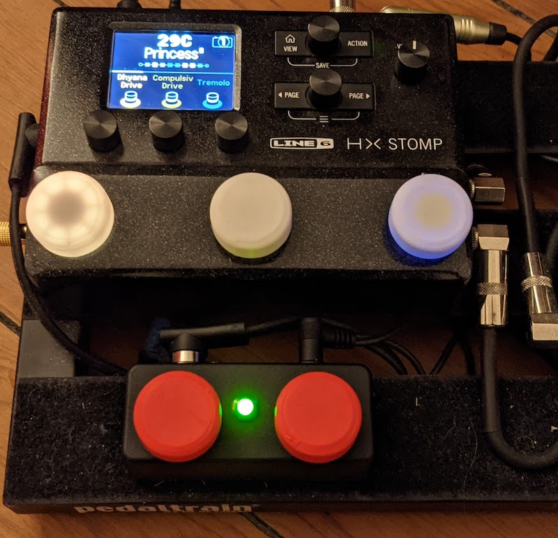
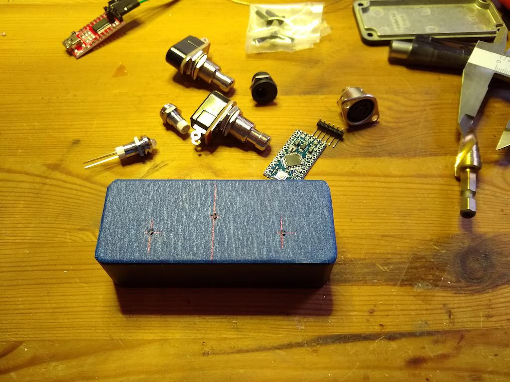
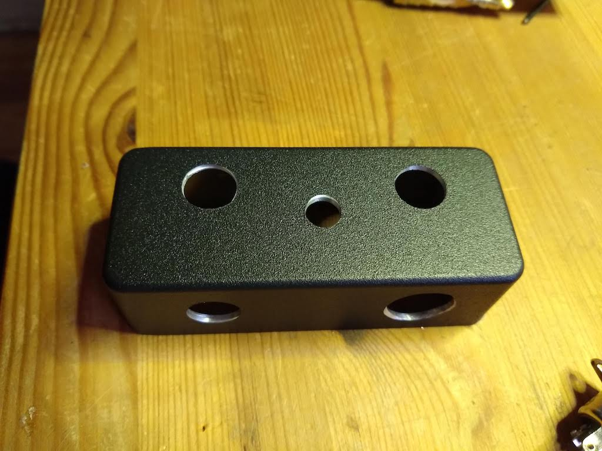
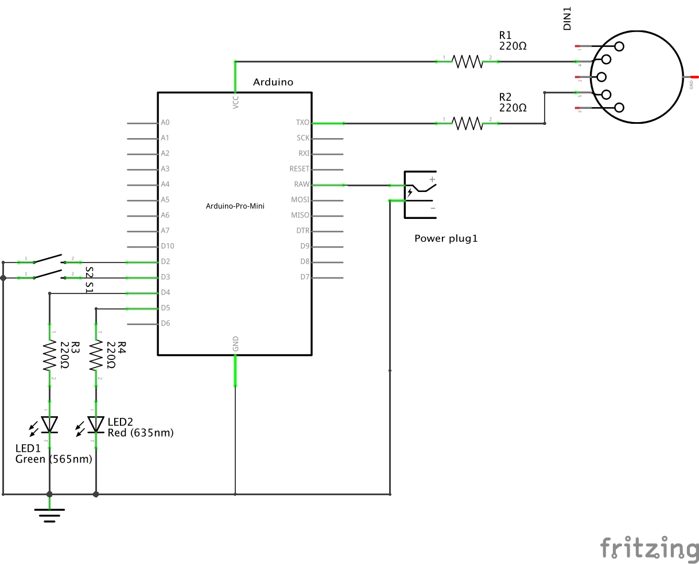
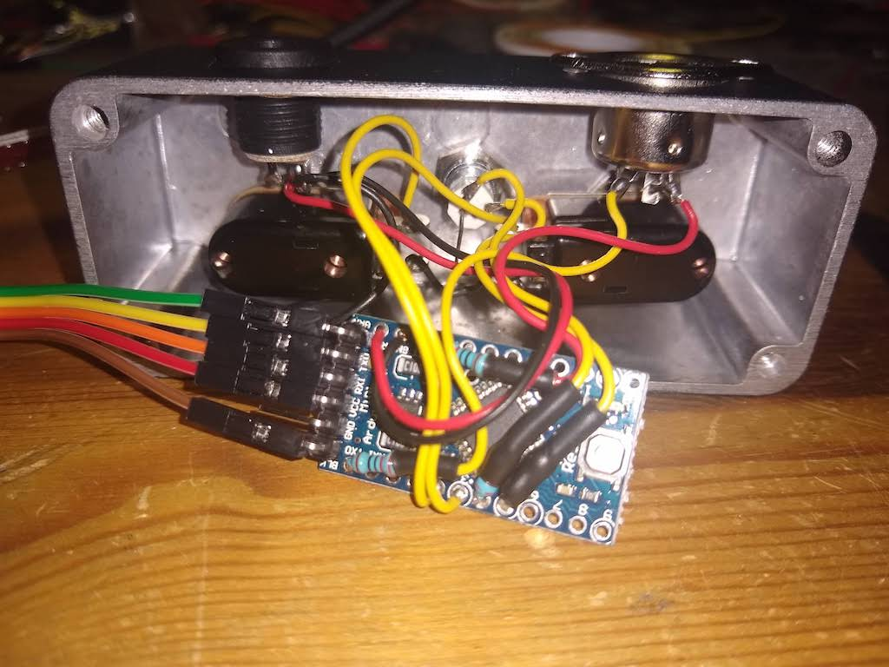
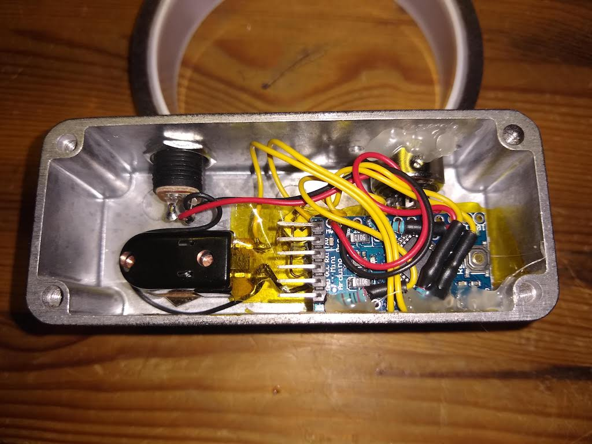
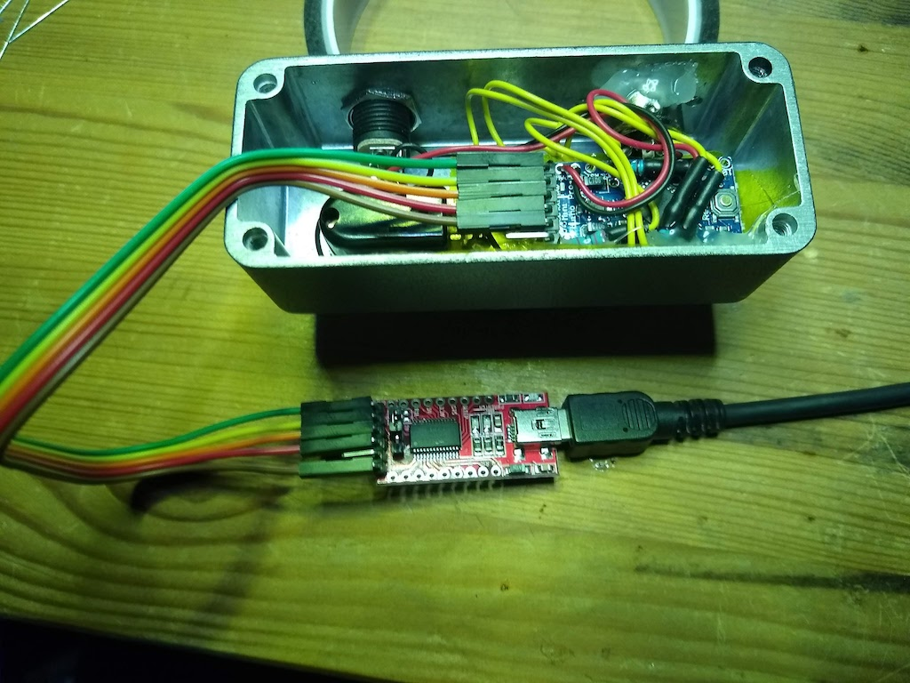

# MIDI Muppet HX

This is a small Arduino based two button MIDI foot switch for the Helix HX Stomp. It is more flexible and more powerful than the "normal" foot switches connected via TRS cable and as a bonus you can still use an expression pedal hooked up to your HX Stomp.

The MIDI Muppet HX can
- scroll up/down through presets (scroll mode)
- scroll up/down through snapshots (snapshot mode)
- act as FS4/FS5 (fs mode)
- bring up the tuner via long press left (dn) button
- act as a two button LOOPER controller

The unit supports three basic modes of operation. The LED will indicate the current mode:

| Mode | LED on boot | LED in operation |
|------|-----|-----------------|
| Scroll preset / Snapshot | flash red | preset: red, snapshot: green, tuner: flash green |
| FS4/FS5 | flash green | green, tuner: flash green |
| Looper  | flash red/green | play: green, record: red, overdub: yellow |

To select a mode, press and hold both buttons until one of the above LED patterns shows up.

Next time the unit is powered on the unit will automatically switch to the mode used last.

SCROLL/SNAPSHOT Mode:

    SCROLL Mode:    up/dn switches program patches
                    long press dn: toggle TUNER
                    long press up: change to SNAPSHOT mode
    SNAPSHOT Mode:  up/dn switches snapshot
                    long press dn: toggle TUNER
                    long press up: back to SCROLL mode
    TUNER Mode:     up or dn back to prev Mode

FS Mode:

    FS Mode:        up/dn emulate FS4/FS5
                    long press dn: toggle TUNER

LOOPER Mode:

    LOOPER Mode:    dn toggles record/play/overdub
                    up toggles play/stop
                    long press dn toggles undo/redo

Attention: Due to the logic of how short and long-press events are detected, all button presses will have an effect on RELEASING the button. This might be a bit odd e.g. when operating the looper at first.

# Building MIDI Muppet HX
Parts are around 20€:
- Stomp case: e.g. Hammond 1590A
- 2 momentary foot switches
- Arduino Pro Mini with programming headers populated
- MIDI/DIN Socket
- 2,1 mm power Socket
- bicolor LED (red/green, common cathode)
- 4 x 220R resistors
- FTDI serial adaptor (for programming)

A little bit of drilling, soldering and hot snot will be required.

# Wiring
- Arduino D2, D3: Button Up/Down to ground
- Arduino D4, D5: via 220R resistor to LED green/red anode, cathode to ground
- Arduino TX pin: via 220R resistor to MIDI pin 5 (data line)
- Arduino 5V/VCC pin: via 220R resistor to MIDI pin 4 (voltage reference line)
- Arduino RAW pin: 9V from power socket
- Arduino GNC pin: GND from power socket

I put a little bit of capton tape on backside of a foot switch and on the the inside of the case for isolation and fixated the Arduino PCB with a little bit of hot snot.

# The Code
The code requires the OneButton library to be installed. The Arduino library manager will be your friend.

# Programming
Disconnect external power supply first! The FTDI adaptor will provide power.

Hook up the FTDI adaptor to the Arduino board, select "Arduino Pro or Pro Mini" in your Arduino IDE, load the code, compile and upload.

The LED will flash rapidly on boot. Congratulations, you have just created a powerful controller for your HX Stomp. Have fun.

